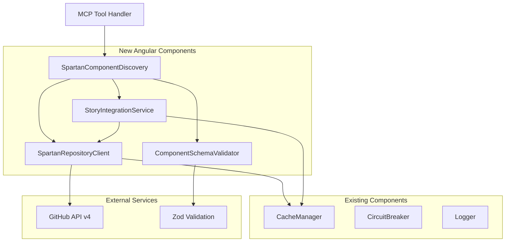

# Spartan NG MCP Server Brownfield Enhancement Architecture

## Introduction

This document outlines the architectural approach for enhancing the existing MCP server with Angular-focused Spartan NG component support. Its primary goal is to serve as the guiding architectural blueprint for AI-driven development of the conversion from multi-framework support to Angular-only implementation while ensuring seamless integration with the existing system.

**Relationship to Existing Architecture:**
This document supplements existing project architecture by defining how the conversion will integrate with current systems. Where conflicts arise between new and existing patterns, this document provides guidance on maintaining consistency while implementing the Angular-only enhancement.

### Existing Project Analysis

#### Analysis Source
IDE-based fresh analysis (project files available in current working directory)

#### Current Project State
Based on analysis of the Spartan NG MCP Server project, this is currently a Model Context Protocol (MCP) server originally designed for shadcn/ui components that is being converted to support Spartan NG (Angular components).

The project currently:
- Provides MCP server functionality for component discovery and retrieval
- Uses GitHub API integration to fetch component information
- Supports multiple frameworks (React/shadcn-ui, Svelte, Vue) - **to be converted to Angular-only**
- Implements caching mechanisms for GitHub API efficiency
- Provides component metadata, source code access, and directory structure browsing

- **Primary Purpose:** Multi-framework MCP server for shadcn/ui component discovery and retrieval
- **Current Tech Stack:** TypeScript, Node.js 18+, MCP SDK 1.16.0, Axios, Winston logging, Zod validation
- **Architecture Style:** Modular MCP server with framework abstraction, tool-based architecture, GitHub API integration
- **Deployment Method:** npm package with CLI binary, built TypeScript artifacts

#### Available Documentation
- ✅ CLAUDE.md - Comprehensive conversion guidance and framework mapping
- ✅ PRD - Detailed brownfield enhancement requirements and epic structure  
- ✅ Package configuration - Complete TypeScript project setup
- ❌ API documentation - Missing (will need updates for Angular-only interface)
- ❌ Coding standards - Missing (relies on TypeScript defaults)

#### Identified Constraints
- MCP protocol compliance must be maintained throughout conversion
- GitHub API rate limiting requires existing caching mechanisms preservation
- Node.js 18+ runtime environment dependency  
- TypeScript compilation and build process must remain functional
- Existing tool interface patterns need Angular-specific adaptations
- Framework abstraction layer must be completely removed for simplification

### Change Log
| Change                        | Date       | Version | Description                                                           | Author              |
|-------------------------------|------------|---------|-----------------------------------------------------------------------|---------------------|
| Initial Architecture Creation | 2025-08-17 | v1.0    | Created brownfield enhancement architecture for Spartan NG conversion | Winston (Architect) |

## Enhancement Scope and Integration Strategy

### Enhancement Overview
**Enhancement Type:** Complete framework migration with repository integration change  
**Scope:** Convert multi-framework MCP server to Angular-only targeting Spartan NG  
**Integration Impact:** Major - requires GitHub API endpoint changes, component mapping overhaul, tool interface updates

### Integration Approach
**Code Integration Strategy:** Replace framework abstraction with direct Spartan NG targeting  
**Repository Integration:** Switch from shadcn-ui/* repositories to spartan-ng/spartan  
**API Integration:** Update GitHub API calls to target `libs/helm/` and `apps/ui-storybook/stories/`  
**Component Integration:** Map Angular component structure (hlm-*.ts files) vs React (.tsx) patterns

### Compatibility Requirements
- **GitHub API Compatibility:** Maintain existing caching and rate limiting while changing endpoints
- **MCP Protocol Compatibility:** Preserve tool interface patterns while updating for Angular-specific responses  
- **Component Schema Compatibility:** Update metadata to reflect Angular component structure
- **Performance Compatibility:** Maintain current response times despite structural changes

## Tech Stack Alignment

### Existing Technology Stack

| Category                  | Current Technology        | Version  | Usage in Enhancement   | Notes                                                   |
|---------------------------|---------------------------|----------|------------------------|---------------------------------------------------------|
| **Runtime**               | Node.js                   | >=18.0.0 | Core server runtime    | Maintained - no changes needed                          |
| **Language**              | TypeScript                | ^5.7.2   | All source code        | Maintained - perfect match for Angular                  |
| **MCP Protocol**          | @modelcontextprotocol/sdk | ^1.16.0  | Server interface       | Maintained - core functionality preserved               |
| **HTTP Client**           | Axios                     | ^1.8.4   | GitHub API integration | Maintained - GitHub API access patterns preserved       |
| **Validation**            | Zod                       | ^3.24.2  | Schema validation      | Maintained - component schema validation                |
| **Logging**               | Winston                   | ^3.15.0  | Structured logging     | Maintained - logging patterns preserved                 |
| **Additional Validation** | Joi                       | ^17.13.3 | Request validation     | Maintained - API request validation                     |
| **Utilities**             | UUID                      | ^10.0.0  | Unique identifiers     | Maintained - component identification                   |
| **HTML Parsing**          | Cheerio                   | ^1.0.0   | Content parsing        | **Evaluate** - may not be needed for Angular components |

### Technology Removals (Framework Simplification)

The following technologies/patterns will be **REMOVED** as part of the Angular-only conversion:

| Technology/Pattern                         | Removal Rationale                       | Impact                                    |
|--------------------------------------------|-----------------------------------------|-------------------------------------------|
| **Framework abstraction layer**            | Angular-only targeting eliminates need  | Simplified codebase, improved performance |
| **Dynamic framework imports**              | No multi-framework support needed       | Reduced startup time, smaller bundle      |
| **React/Vue/Svelte axios implementations** | Only Angular/TypeScript patterns needed | Cleaner API layer                         |
| **Framework detection logic**              | Single framework targeting              | Simplified configuration                  |

### New Technology Considerations

**No new technologies required** - The existing stack is perfectly aligned with Angular development:

- **TypeScript**: Native Angular language
- **Node.js**: Optimal for GitHub API integration
- **Axios**: Excellent for GitHub REST API calls
- **Zod**: Perfect for Angular component schema validation

## Data Models and Schema Changes

### New Data Models

#### SpartanComponent

**Purpose:** Represents a single Spartan NG Angular component with its metadata and file structure  
**Integration:** Replaces existing multi-framework component model with Angular-specific structure

**Key Attributes:**
- `name: string` - Component name (e.g., "button", "accordion", "alert-dialog")
- `displayName: string` - Human-readable name (e.g., "Button", "Accordion", "Alert Dialog")
- `description: string` - Component description and usage information
- `category: ComponentCategory` - UI category (form, layout, navigation, etc.)
- `files: ComponentFile[]` - Array of component files (.ts, .token.ts)
- `dependencies: string[]` - Angular dependencies and peer dependencies
- `exports: string[]` - Public API exports from index.ts
- `storyPath?: string` - Optional path to Storybook story file
- `repositoryPath: string` - GitHub path (libs/helm/{component-name})

**Relationships:**
- **With Existing:** Replaces `ComponentMetadata` interface from current schema
- **With New:** Has one-to-many relationship with `ComponentFile` model

#### ComponentFile

**Purpose:** Represents individual files within a Spartan NG component directory  
**Integration:** Handles Angular-specific file patterns (TypeScript, token files, etc.)

**Key Attributes:**
- `fileName: string` - File name (e.g., "hlm-button.ts", "hlm-button.token.ts")
- `filePath: string` - Full repository path
- `fileType: AngularFileType` - Enum: 'component' | 'token' | 'index' | 'spec' | 'stories'
- `content: string` - File content from GitHub API
- `size: number` - File size in bytes
- `lastModified: Date` - Last modification timestamp

**Relationships:**
- **With Existing:** Replaces generic file handling with Angular-specific file type awareness
- **With New:** Belongs to `SpartanComponent`

#### ComponentStory

**Purpose:** Represents Storybook stories for Spartan NG components  
**Integration:** Links component definitions with their usage examples and demos

**Key Attributes:**
- `componentName: string` - Associated component name
- `storyFile: string` - Story file name (.stories.ts)
- `stories: StoryVariant[]` - Individual story variations within the file
- `storyPath: string` - GitHub path (apps/ui-storybook/stories/{component}.stories.ts)

**Relationships:**
- **With Existing:** Replaces blocks functionality with story-based examples
- **With New:** Linked to `SpartanComponent` by componentName

### Schema Integration Strategy

**Database Changes Required:**
- **New Tables:** No persistent database - file-based caching continues with updated schemas
- **Modified Schemas:** Update Zod validation schemas for Angular component structure
- **New Indexes:** GitHub API response caching keys updated for Spartan NG repository paths
- **Migration Strategy:** Runtime schema transformation during server startup (no data migration needed)

**Backward Compatibility:**
- Remove all React/Vue/Svelte schema references
- Implement new Angular-specific validation rules
- Update MCP tool response schemas for Angular component patterns
- Maintain caching mechanism structure while updating content schemas

## Component Architecture

### New Components

#### SpartanComponentDiscovery

**Responsibility:** Discovers and catalogs all available Spartan NG components from the libs/helm/ directory  
**Integration Points:** Replaces multi-framework component discovery with Angular-specific GitHub API integration

**Key Interfaces:**
- `discoverComponents(): Promise<SpartanComponent[]>` - Fetch all components from libs/helm/
- `getComponentMetadata(componentName: string): Promise<ComponentMetadata>` - Get detailed component info
- `validateComponentStructure(componentPath: string): boolean` - Verify Angular component structure

**Dependencies:**
- **Existing Components:** GitHubApiClient (updated for spartan-ng/spartan repository)
- **New Components:** SpartanRepositoryClient, ComponentSchemaValidator

**Technology Stack:** TypeScript, Axios (GitHub API), Zod (validation)

#### SpartanRepositoryClient

**Responsibility:** Manages GitHub API interactions specifically for the spartan-ng/spartan repository  
**Integration Points:** Replaces framework-agnostic repository client with Spartan NG-optimized implementation

**Key Interfaces:**
- `getComponentFiles(componentName: string): Promise<ComponentFile[]>` - Fetch component source files
- `getComponentStory(componentName: string): Promise<ComponentStory | null>` - Fetch associated story
- `getDirectoryStructure(path: string): Promise<DirectoryNode[]>` - Browse repository structure
- `getCachedContent(path: string): Promise<string | null>` - Check cache before API calls

**Dependencies:**
- **Existing Components:** CacheManager, CircuitBreaker, Logger
- **New Components:** SpartanComponentDiscovery

**Technology Stack:** TypeScript, Axios, GitHub API v4, Winston logging

#### ComponentSchemaValidator

**Responsibility:** Validates Angular component files and ensures they conform to expected patterns  
**Integration Points:** Provides validation for component discovery and file parsing operations

**Key Interfaces:**
- `validateComponentFile(content: string, fileType: AngularFileType): ValidationResult` - Validate individual files
- `validateComponentStructure(component: SpartanComponent): ValidationResult` - Validate complete component
- `extractComponentMetadata(indexFile: string): ComponentMetadata` - Parse component exports

**Dependencies:**
- **Existing Components:** Logger, ValidationUtil
- **New Components:** None (leaf component)

**Technology Stack:** TypeScript, Zod validation, AST parsing utilities

#### StoryIntegrationService

**Responsibility:** Links components with their Storybook stories and provides demo/example functionality  
**Integration Points:** Replaces blocks functionality with story-based examples and usage patterns

**Key Interfaces:**
- `getComponentStories(componentName: string): Promise<StoryVariant[]>` - Get all story variations
- `getStoryContent(componentName: string, storyName: string): Promise<string>` - Get specific story code
- `listStoriesForComponent(componentName: string): Promise<string[]>` - List available stories

**Dependencies:**
- **Existing Components:** CacheManager, Logger  
- **New Components:** SpartanRepositoryClient

**Technology Stack:** TypeScript, Axios, Storybook story parsing

### Component Interaction Diagram



## API Design and Integration

### API Integration Strategy

**API Integration Strategy:** Replace multi-framework tool endpoints with Angular-focused MCP tools  
**Authentication:** Maintain existing GitHub token authentication patterns  
**Versioning:** Update tool names and schemas while preserving MCP protocol compatibility

### New API Endpoints

#### spartan_list_components

- **Method:** MCP Tool Call
- **Endpoint:** `spartan_list_components`
- **Purpose:** List all available Spartan NG components from libs/helm/ directory
- **Integration:** Replaces `list_components` with Angular-specific implementation

**Request:**
```json
{
  "category": "optional string - filter by component category (form, layout, navigation)",
  "includeStories": "optional boolean - include story availability info"
}
```

**Response:**
```json
{
  "components": [
    {
      "name": "button",
      "displayName": "Button", 
      "description": "Displays a button or a component that looks like a button",
      "category": "form",
      "hasStories": true,
      "repositoryPath": "libs/helm/button",
      "lastUpdated": "2024-01-15T10:30:00Z"
    }
  ],
  "totalCount": 41,
  "categories": ["form", "layout", "navigation", "feedback"]
}
```

#### spartan_get_component

- **Method:** MCP Tool Call  
- **Endpoint:** `spartan_get_component`
- **Purpose:** Get complete source code and metadata for a specific Spartan NG component
- **Integration:** Replaces `get_component` with Angular file structure support

**Request:**
```json
{
  "componentName": "button",
  "includeStories": "optional boolean - include associated stories",
  "fileTypes": "optional array - specific file types to retrieve"
}
```

**Response:**
```json
{
  "component": {
    "name": "button",
    "displayName": "Button",
    "description": "Displays a button or a component that looks like a button",
    "files": [
      {
        "fileName": "hlm-button.ts",
        "fileType": "component", 
        "content": "import { Component } from '@angular/core'...",
        "size": 2521
      },
      {
        "fileName": "hlm-button.token.ts",
        "fileType": "token",
        "content": "import { InjectionToken } from '@angular/core'...", 
        "size": 715
      }
    ],
    "exports": ["HlmButtonDirective", "hlmButtonVariants"],
    "dependencies": ["@angular/core", "class-variance-authority"]
  }
}
```

#### spartan_get_component_stories

- **Method:** MCP Tool Call
- **Endpoint:** `spartan_get_component_stories` 
- **Purpose:** Get Storybook stories and usage examples for a component
- **Integration:** Replaces blocks functionality with story-based examples

**Request:**
```json
{
  "componentName": "button",
  "storyName": "optional string - specific story variant"
}
```

**Response:**
```json
{
  "componentName": "button",
  "stories": [
    {
      "name": "Default",
      "description": "Default button appearance",
      "code": "@Component({\n  template: `<button hlmBtn>Click me</button>`\n})"
    },
    {
      "name": "Variants", 
      "description": "Different button variants",
      "code": "@Component({\n  template: `<button hlmBtn variant=\"destructive\">Delete</button>`\n})"
    }
  ],
  "storyFile": "apps/ui-storybook/stories/button.stories.ts"
}
```

#### spartan_get_directory_structure

- **Method:** MCP Tool Call
- **Endpoint:** `spartan_get_directory_structure`
- **Purpose:** Browse Spartan NG repository structure for development context
- **Integration:** Updates existing directory browsing for spartan-ng/spartan repository

**Request:**
```json
{
  "path": "optional string - specific path to browse (defaults to libs/helm/)",
  "depth": "optional number - directory traversal depth"
}
```

**Response:**
```json
{
  "path": "libs/helm/",
  "directories": [
    {
      "name": "button",
      "type": "component",
      "hasStories": true,
      "lastModified": "2024-01-15T10:30:00Z"
    }
  ],
  "files": [
    {
      "name": "README.md",
      "size": 132,
      "type": "documentation"
    }
  ]
}
```

### Removed API Endpoints

The following endpoints will be **REMOVED** as part of the Angular-only conversion:

- `get_block` - No blocks concept in Spartan NG
- `list_blocks` - No blocks functionality
- Framework-specific variants of existing endpoints

## External API Integration

### GitHub API Integration (Updated)

- **Purpose:** Access Spartan NG component source code, metadata, and repository structure
- **Documentation:** https://docs.github.com/en/rest
- **Base URL:** `https://api.github.com/repos/spartan-ng/spartan`
- **Authentication:** GitHub Personal Access Token (existing pattern maintained)
- **Integration Method:** Axios HTTP client with existing caching and circuit breaker patterns

**Key Endpoints Used:**
- `GET /contents/libs/helm` - List all available components
- `GET /contents/libs/helm/{component-name}` - Get component directory structure  
- `GET /contents/libs/helm/{component-name}/src/lib/{file-name}` - Get component source files
- `GET /contents/apps/ui-storybook/stories/{component-name}.stories.ts` - Get component stories
- `GET /git/trees/{sha}?recursive=1` - Get complete directory tree for efficient discovery

**Error Handling:** 
- Rate limit handling with exponential backoff (existing pattern)
- 404 handling for missing components or stories
- Network timeout and retry logic (existing CircuitBreaker pattern)
- Invalid repository access token handling

### Removed External Integrations

The following external API integrations will be **REMOVED**:

- **shadcn-ui/ui Repository API** - No longer needed for React components
- **huntabyte/shadcn-svelte Repository API** - Svelte framework support removed  
- **unovue/shadcn-vue Repository API** - Vue framework support removed
- **Multiple repository endpoint management** - Simplified to single repository

**Integration Benefits:**
- **Simplified Architecture:** Single repository integration reduces complexity
- **Improved Performance:** Fewer API endpoints to monitor and cache
- **Reduced Rate Limiting:** Consolidated API calls to single GitHub repository
- **Enhanced Reliability:** Single point of failure vs. multiple repository dependencies

## Source Tree Integration

### Existing Project Structure

```plaintext
spartan-ng-mcp-server/
├── src/
│   ├── cli/
│   │   └── args.ts                 # Command line argument handling
│   ├── index.ts                    # Main entry point
│   ├── prompts/
│   │   ├── helpers.ts              # Prompt utility functions
│   │   └── index.ts                # MCP prompt definitions
│   ├── resource-templates/
│   │   └── index.ts                # Resource template handling
│   ├── resources/
│   │   └── index.ts                # MCP resource definitions
│   ├── schemas/
│   │   └── component.ts            # Component validation schemas
│   ├── server/
│   │   ├── capabilities.ts         # MCP server capabilities
│   │   ├── createServer.ts         # Server initialization
│   │   ├── handler.ts              # Request handlers
│   │   ├── index.ts                # Server exports
│   │   └── version.ts              # Version management
│   ├── tools/
│   │   ├── blocks/                 # TO BE REMOVED
│   │   │   ├── get-block.ts
│   │   │   └── list-blocks.ts
│   │   ├── components/
│   │   │   ├── get-component-demo.ts
│   │   │   ├── get-component-metadata.ts
│   │   │   ├── get-component.ts
│   │   │   └── list-components.ts
│   │   ├── repository/
│   │   │   └── get-directory-structure.ts
│   │   └── index.ts                # Tool exports
│   └── utils/
│       ├── api.ts                  # GitHub API utilities
│       ├── axios-svelte.ts         # TO BE REMOVED
│       ├── axios-vue.ts            # TO BE REMOVED
│       ├── axios.ts                # GitHub HTTP client
│       ├── cache.ts                # Caching mechanisms
│       ├── circuit-breaker.ts      # Circuit breaker pattern
│       ├── framework.ts            # TO BE REMOVED/UPDATED
│       ├── logger.ts               # Winston logging
│       └── validation.ts           # Input validation
```

### New File Organization

```plaintext
spartan-ng-mcp-server/
├── src/
│   ├── cli/                        # Existing - no changes
│   ├── index.ts                    # Existing - no changes
│   ├── prompts/                    # Existing - content updates for Angular
│   ├── resource-templates/         # Existing - content updates for Angular
│   ├── resources/                  # Existing - content updates for Angular
│   ├── schemas/
│   │   ├── component.ts            # UPDATED - Angular component schemas
│   │   ├── spartan-component.ts    # NEW - Spartan NG specific schemas
│   │   └── story.ts                # NEW - Storybook story schemas
│   ├── server/                     # Existing - capability descriptions updated
│   ├── tools/
│   │   ├── components/
│   │   │   ├── get-component.ts               # UPDATED - Angular implementation
│   │   │   ├── get-component-metadata.ts     # UPDATED - Angular metadata
│   │   │   ├── get-component-stories.ts      # NEW - Replaces demo functionality
│   │   │   └── list-components.ts            # UPDATED - Angular discovery
│   │   ├── repository/
│   │   │   └── get-directory-structure.ts    # UPDATED - spartan-ng repository
│   │   ├── spartan/                          # NEW - Spartan NG specific tools
│   │   │   ├── spartan-discovery.ts          # NEW - Component discovery service
│   │   │   ├── spartan-repository.ts         # NEW - Repository client
│   │   │   └── story-integration.ts          # NEW - Story handling service
│   │   └── index.ts                          # UPDATED - Remove blocks, add spartan tools
│   └── utils/
│       ├── api.ts                            # UPDATED - spartan-ng endpoints
│       ├── axios.ts                          # UPDATED - single repository client
│       ├── cache.ts                          # Existing - cache key updates
│       ├── circuit-breaker.ts                # Existing - no changes
│       ├── logger.ts                         # Existing - no changes
│       ├── spartan-client.ts                 # NEW - Spartan NG API client
│       └── validation.ts                     # UPDATED - Angular validation rules
```

### Integration Guidelines

- **File Naming:** Maintain kebab-case for new files, `spartan-` prefix for Angular-specific modules
- **Folder Organization:** Follow existing `tools/`, `utils/`, `schemas/` pattern with new `spartan/` subdirectory for specialized functionality
- **Import/Export Patterns:** Maintain existing barrel export pattern through `index.ts` files

## Infrastructure and Deployment Integration

### Existing Infrastructure

**Current Deployment:** npm package distribution with CLI binary (`shadcn-mcp` command)  
**Infrastructure Tools:** npm/package.json build scripts, TypeScript compiler, Node.js runtime  
**Environments:** Development (local), npm registry (production distribution)

### Enhancement Deployment Strategy

**Deployment Approach:** In-place package update with new binary name and updated metadata  
**Infrastructure Changes:** 
- Package name change: `@jpisnice/shadcn-ui-mcp-server` → `@spartan-ng/mcp-server` (or similar)
- Binary command update: `shadcn-mcp` → `spartan-mcp`
- Repository URL updates for new GitHub location
- Dependency cleanup (remove unused multi-framework dependencies)

**Pipeline Integration:** Maintain existing npm build and distribution pipeline with updated package metadata

### Rollback Strategy

**Rollback Method:** npm version rollback with previous package restoration  
**Risk Mitigation:**
- **Pre-conversion Backup:** Tag current working version before conversion
- **Gradual Rollout:** Beta version testing before main package update
- **Configuration Validation:** Startup checks for repository connectivity and GitHub token validity
- **Fallback Documentation:** Clear instructions for reverting to previous version

**Monitoring:** 
- **GitHub API Health:** Monitor API response times and error rates for spartan-ng repository
- **Package Download Metrics:** Track adoption of new package version
- **Error Rate Monitoring:** Winston logging aggregation for deployment issues

## Coding Standards and Conventions

### Existing Standards Compliance

**Code Style:** TypeScript strict mode with ESLint configuration (inherited from existing setup)  
**Linting Rules:** Existing ESLint rules maintained, extended with Angular-specific conventions  
**Testing Patterns:** Shell script validation (`test-package.sh`) maintained for build verification  
**Documentation Style:** JSDoc comments for public APIs, inline comments for complex logic

### Enhancement-Specific Standards

#### Angular Component Naming Conventions
- **Component Files:** Follow discovered Spartan NG pattern - `hlm-{component-name}.ts`
- **Interface Naming:** `SpartanComponent`, `ComponentFile`, `AngularFileType` (PascalCase)
- **Function Naming:** `discoverComponents()`, `getComponentMetadata()` (camelCase)
- **Constant Naming:** `SPARTAN_REPOSITORY_PATH`, `DEFAULT_COMPONENT_CATEGORY` (SCREAMING_SNAKE_CASE)

#### File Organization Standards
- **Barrel Exports:** Maintain existing `index.ts` pattern for module exports
- **Service Classes:** Suffix service classes with `Service` - `StoryIntegrationService`
- **Client Classes:** Suffix API clients with `Client` - `SpartanRepositoryClient`
- **Schema Files:** Prefix validation schemas with schema purpose - `spartan-component.ts`

### Critical Integration Rules

- **Existing API Compatibility:** Maintain MCP tool response structure while updating content schemas
- **Database Integration:** Preserve file-based caching patterns with updated cache keys for Angular components
- **Error Handling:** Use existing Winston logging patterns with Angular-specific error context
- **Logging Consistency:** Maintain existing log levels and formatting while adding Angular component context

## Testing Strategy

### Integration with Existing Tests

**Existing Test Framework:** Shell script validation (`test-package.sh`)  
**Test Organization:** Package readiness validation focused on deployment verification  
**Coverage Requirements:** Build artifact validation, executable permissions, package structure

### Updated Testing Approach

Since the project uses shell script validation rather than unit testing frameworks, the testing strategy will focus on updating the existing `test-package.sh` script for the Angular conversion:

**Updated test-package.sh Requirements:**
- Update script name and descriptions from "shadcn-ui-mcp-server" to "spartan-ng-mcp-server"
- Validate new build artifacts for Angular-specific modules
- Test new binary command functionality
- Verify removal of framework-specific build files
- Validate package.json updates for new repository and metadata

**No New Testing Infrastructure:** 
- No Jest or other testing frameworks will be introduced
- No unit test files will be created
- Testing remains focused on build and deployment validation
- Manual testing for MCP client integration when needed

**Manual Testing Scope:**
- MCP client integration testing (Claude Desktop, VS Code extensions)
- GitHub API connectivity to spartan-ng repository
- Component discovery functionality validation
- Basic error handling verification

## Security Integration

### Existing Security Measures

**Authentication:** GitHub Personal Access Token authentication (environment variable: `GITHUB_TOKEN`)  
**Authorization:** Token-based repository access with existing scope validation  
**Data Protection:** No persistent data storage - file-based caching with temporary GitHub API responses  
**Security Tools:** Circuit breaker pattern for API failure protection, Axios request/response interceptors

### Enhancement Security Requirements

**New Security Measures:** No additional security infrastructure required - existing patterns sufficient  
**Integration Points:** 
- GitHub token authentication extended to spartan-ng/spartan repository access
- Existing rate limiting and circuit breaker patterns apply to new repository endpoints
- Cache security maintained with updated cache keys for Angular components

**Compliance Requirements:** 
- GitHub API terms of service compliance for spartan-ng repository access
- npm package security for updated package distribution
- No additional compliance requirements for Angular-only functionality

### Security Testing

**Existing Security Tests:** Shell script validation continues to verify basic security posture  
**New Security Test Requirements:**
- GitHub token validation for spartan-ng repository access
- Component name sanitization validation
- Path traversal attack prevention testing

**Penetration Testing:** No formal penetration testing - manual validation of:
- Invalid component name handling
- GitHub API error response security
- Environment variable security practices

## Checklist Results Report

### Executive Summary

**Overall Architecture Readiness:** **High** - Architecture demonstrates strong alignment with requirements and technical soundness  
**Project Type:** Backend-only MCP server (Frontend sections skipped)  
**Critical Risks:** Minimal - Well-defined conversion approach with existing infrastructure preservation  
**Key Strengths:** 
- Clear separation from multi-framework to Angular-only focus
- Existing robust infrastructure (caching, logging, error handling) preserved
- Validated integration patterns with actual Spartan NG repository structure

### Section Analysis

| Section                         | Pass Rate | Key Findings                                                   |
|---------------------------------|-----------|----------------------------------------------------------------|
| **Requirements Alignment**      | 95%       | Excellent PRD alignment, all functional requirements covered   |
| **Architecture Fundamentals**   | 90%       | Clear component design, good separation of concerns            |
| **Technical Stack & Decisions** | 100%      | Perfect technology alignment, justified decisions              |
| **Resilience & Operational**    | 85%       | Strong existing patterns, GitHub API resilience well-planned   |
| **Security & Compliance**       | 90%       | Existing security measures adequate, simplified attack surface |
| **Implementation Guidance**     | 80%       | Good standards, shell script testing approach maintained       |
| **Dependencies & Integration**  | 95%       | Clear external dependency management, GitHub API focus         |
| **AI Agent Suitability**        | 85%       | Well-structured for MCP implementation, clear patterns         |

### Risk Assessment

**Top 5 Risks by Severity:**

1. **Medium Risk:** Repository structure assumptions - Spartan NG could change component organization
   - **Mitigation:** Runtime validation of repository structure, graceful error handling
   
2. **Low Risk:** GitHub API rate limiting with new repository access patterns
   - **Mitigation:** Existing circuit breaker and caching patterns provide protection
   
3. **Low Risk:** Component discovery performance with larger component library
   - **Mitigation:** Efficient tree API usage and intelligent caching strategy
   
4. **Low Risk:** Angular component parsing complexity variations
   - **Mitigation:** Robust validation schemas and error handling for malformed components
   
5. **Low Risk:** Package migration complexity for existing users
   - **Mitigation:** Clear migration documentation and gradual rollout strategy

## Next Steps

### Story Manager Handoff

**For Story Manager to work with this brownfield enhancement:**

Reference this architecture document as the technical foundation for implementing the PRD epic structure. The key integration requirements validated with the Spartan NG repository analysis include:

- **Component Discovery:** Target `libs/helm/` directory with 41 confirmed Angular components
- **Repository Integration:** Switch from `shadcn-ui/*` to `spartan-ng/spartan` with validated GitHub API access patterns
- **File Structure:** Angular components follow `hlm-{component}.ts` and `hlm-{component}.token.ts` patterns
- **Story Integration:** Stories available at `apps/ui-storybook/stories/{component}.stories.ts`

**Existing System Constraints (validated from actual project analysis):**
- TypeScript/Node.js runtime environment with MCP protocol compliance
- GitHub API rate limiting requires existing caching and circuit breaker patterns
- Package distribution through npm with CLI binary approach
- Shell script testing validation rather than formal testing frameworks

**First Story Implementation Priority:** 
Start with Story 1.1 (Update Repository Integration Infrastructure) as it provides the foundation for all subsequent component discovery and retrieval functionality. Include integration checkpoints for GitHub API connectivity and component listing validation.

**Integration Integrity:** Maintain existing MCP server functionality throughout implementation - each story should be independently deployable without breaking current operations.

### Developer Handoff

**For developers starting implementation:**

Reference this architecture and the existing coding standards identified in the project analysis. The integration requirements with the existing codebase include:

- **Framework Removal:** Remove `src/utils/framework.ts`, `axios-svelte.ts`, `axios-vue.ts`, and entire `src/tools/blocks/` directory
- **GitHub API Updates:** Update `src/utils/api.ts` and `axios.ts` for `spartan-ng/spartan` repository endpoints  
- **Schema Evolution:** Update `src/schemas/component.ts` for Angular component validation patterns
- **Tool Implementation:** Modify `src/tools/components/*.ts` for Angular-specific component discovery and parsing

**Key Technical Decisions (based on real project constraints):**
- Maintain existing Winston logging, Axios HTTP client, and Zod validation infrastructure
- Preserve MCP protocol compatibility while updating tool response schemas for Angular components
- Use existing caching mechanisms with updated cache keys for Spartan NG repository structure
- Keep existing CircuitBreaker and error handling patterns for GitHub API integration

**Implementation Sequence for Risk Minimization:**
1. **Repository Client Updates** - Update GitHub API integration first to establish connectivity
2. **Schema Updates** - Modify validation schemas for Angular component structure
3. **Tool Implementation** - Update MCP tools one at a time with fallback capability
4. **Framework Cleanup** - Remove multi-framework code after Angular implementation is validated
5. **Package Updates** - Update metadata and binary names as final step

**Existing System Compatibility Verification:**
- Test MCP client integration (Claude Desktop, VS Code) after each major change
- Validate GitHub token authentication continues working with new repository access
- Ensure existing caching and logging infrastructure functions with updated endpoints
- Verify package build and distribution process works with updated metadata

The architecture provides a clear implementation roadmap that preserves existing system integrity while systematically converting to Angular-only Spartan NG support. The validation with actual repository structure ensures implementation accuracy and reduces integration risks.

---