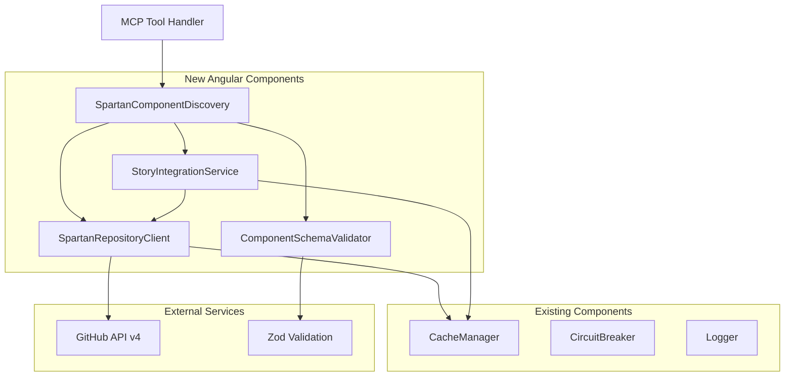

# Component Architecture

## New Components

### SpartanComponentDiscovery

**Responsibility:** Discovers and catalogs all available Spartan NG components from the libs/helm/ directory  
**Integration Points:** Replaces multi-framework component discovery with Angular-specific GitHub API integration

**Key Interfaces:**
- `discoverComponents(): Promise<SpartanComponent[]>` - Fetch all components from libs/helm/
- `getComponentMetadata(componentName: string): Promise<ComponentMetadata>` - Get detailed component info
- `validateComponentStructure(componentPath: string): boolean` - Verify Angular component structure

**Dependencies:**
- **Existing Components:** GitHubApiClient (updated for spartan-ng/spartan repository)
- **New Components:** SpartanRepositoryClient, ComponentSchemaValidator

**Technology Stack:** TypeScript, Axios (GitHub API), Zod (validation)

### SpartanRepositoryClient

**Responsibility:** Manages GitHub API interactions specifically for the spartan-ng/spartan repository  
**Integration Points:** Replaces framework-agnostic repository client with Spartan NG-optimized implementation

**Key Interfaces:**
- `getComponentFiles(componentName: string): Promise<ComponentFile[]>` - Fetch component source files
- `getComponentStory(componentName: string): Promise<ComponentStory | null>` - Fetch associated story
- `getDirectoryStructure(path: string): Promise<DirectoryNode[]>` - Browse repository structure
- `getCachedContent(path: string): Promise<string | null>` - Check cache before API calls

**Dependencies:**
- **Existing Components:** CacheManager, CircuitBreaker, Logger
- **New Components:** SpartanComponentDiscovery

**Technology Stack:** TypeScript, Axios, GitHub API v4, Winston logging

### ComponentSchemaValidator

**Responsibility:** Validates Angular component files and ensures they conform to expected patterns  
**Integration Points:** Provides validation for component discovery and file parsing operations

**Key Interfaces:**
- `validateComponentFile(content: string, fileType: AngularFileType): ValidationResult` - Validate individual files
- `validateComponentStructure(component: SpartanComponent): ValidationResult` - Validate complete component
- `extractComponentMetadata(indexFile: string): ComponentMetadata` - Parse component exports

**Dependencies:**
- **Existing Components:** Logger, ValidationUtil
- **New Components:** None (leaf component)

**Technology Stack:** TypeScript, Zod validation, AST parsing utilities

### StoryIntegrationService

**Responsibility:** Links components with their Storybook stories and provides demo/example functionality  
**Integration Points:** Replaces blocks functionality with story-based examples and usage patterns

**Key Interfaces:**
- `getComponentStories(componentName: string): Promise<StoryVariant[]>` - Get all story variations
- `getStoryContent(componentName: string, storyName: string): Promise<string>` - Get specific story code
- `listStoriesForComponent(componentName: string): Promise<string[]>` - List available stories

**Dependencies:**
- **Existing Components:** CacheManager, Logger  
- **New Components:** SpartanRepositoryClient

**Technology Stack:** TypeScript, Axios, Storybook story parsing

## Component Interaction Diagram

